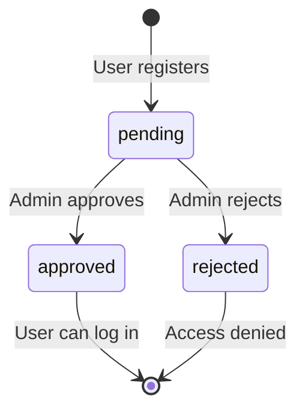
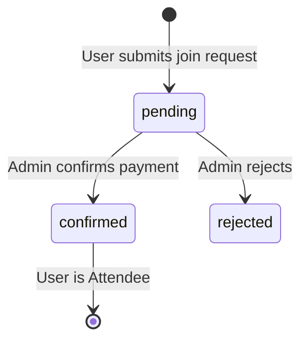

# Design Document: Zevents

## Overview

Zevents is a mobile-first Progressive Web Application (PWA) for managing community sports events (football, cricket, etc.). It is built with Next.js, deployed on Netlify, backed by MongoDB Atlas, and styled with Material UI.

The system has two actor types:
- **Admin** — a single privileged operator with fixed credentials who manages users, creates/edits/deletes events, and confirms join requests after payment.
- **User** — a community member who registers, awaits approval, browses events, and submits join requests.

The core lifecycle is:
```
Visitor registers → Admin approves → User logs in → User marks IN for event →
Admin confirms payment → User becomes Attendee
```

The application is installable as a PWA (Add to Home Screen) and renders responsively down to 320px screens.

---

## Architecture

Zevents follows the **Next.js full-stack pattern**: a single repository with React pages on the frontend and Next.js API routes on the backend. There is no separate server process, making it compatible with Netlify's serverless build pipeline.

```mermaid
graph TD
    subgraph Client (Browser / PWA)
        UI[Material UI Pages]
        SW[Service Worker]
        Manifest[PWA Manifest]
    end

    subgraph Next.js App (Netlify Functions)
        Pages[Next.js Pages / App Router]
        API[API Routes /api/*]
        Auth[Auth Middleware]
        DB[MongoDB Client Singleton]
    end

    subgraph Data Store
        Mongo[(MongoDB Atlas)]
    end

    UI --> Pages
    UI --> API
    API --> Auth
    API --> DB
    DB --> Mongo
    SW --> UI
```

### Key Architecture Decisions

| Decision | Choice | Rationale |
|---|---|---|
| Auth mechanism | JWT stored in HTTP-only cookies | Stateless, works across Netlify functions, no server sessions needed |
| Admin credentials | Env variables (`ADMIN_USERNAME`, `ADMIN_PASSWORD`) | Simple fixed-credential admin; no admin user record in DB |
| MongoDB connection | Singleton pattern with connection caching | Avoids connection storms in serverless / cold-start environments |
| Frontend state | React Context + SWR for server state | Lightweight; avoids heavy state management overhead |
| PWA offline | Service worker with cache-first for static assets | Static shell loads instantly; dynamic data fetched fresh |

---

## Components and Interfaces

### Page Routes

| Route | Role | Description |
|---|---|---|
| `/` | Public | Landing / login page |
| `/register` | Public | New user registration form |
| `/pending` | Authenticated (pending) | Holding screen shown after registration |
| `/dashboard` | Authenticated (User) | Event listing + join request UI |
| `/admin` | Authenticated (Admin) | Admin overview dashboard |
| `/admin/users` | Admin | Pending user approvals list |
| `/admin/events` | Admin | Event management (create / edit / delete) |
| `/admin/requests` | Admin | Join request review and payment confirmation |

### API Routes

| Endpoint | Method | Auth | Description |
|---|---|---|---|
| `/api/auth/login` | POST | None | Login for Admin or User |
| `/api/auth/logout` | POST | Any | Clear session cookie |
| `/api/auth/me` | GET | Any | Return current session info |
| `/api/users/register` | POST | None | Create new pending User |
| `/api/users` | GET | Admin | List all users (with status filter) |
| `/api/users/[id]/approve` | PATCH | Admin | Approve a user |
| `/api/users/[id]/reject` | PATCH | Admin | Reject a user |
| `/api/events` | GET | User/Admin | List all events |
| `/api/events` | POST | Admin | Create a new event |
| `/api/events/[id]` | PATCH | Admin | Update an event |
| `/api/events/[id]` | DELETE | Admin | Delete an event |
| `/api/events/[id]/attendees` | GET | User/Admin | List confirmed attendees |
| `/api/join-requests` | POST | User | Submit a join request |
| `/api/join-requests` | GET | Admin | List all pending join requests |
| `/api/join-requests/[id]/confirm` | PATCH | Admin | Confirm a join request |
| `/api/join-requests/[id]/reject` | PATCH | Admin | Reject a join request |

### Component Tree (Frontend)

```
_app.tsx
├── AuthProvider (Context)
├── Layout
│   ├── AppBar (Material UI)
│   └── BottomNav (mobile, Material UI)
├── Pages
│   ├── LoginPage
│   │   └── LoginForm
│   ├── RegisterPage
│   │   └── RegisterForm
│   ├── PendingPage
│   ├── UserDashboard
│   │   ├── EventList
│   │   │   └── EventCard (with Join button)
│   │   └── MyRequestsPanel
│   └── AdminDashboard
│       ├── PendingUsersList
│       ├── EventManager
│       │   ├── EventForm (create/edit)
│       │   └── EventTable
│       └── JoinRequestsList
```

---

## Data Models

### MongoDB Collections

#### `users`

```typescript
interface User {
  _id: ObjectId;
  fullName: string;          // display name
  username: string;          // unique, used for login
  status: 'pending' | 'approved' | 'rejected';
  createdAt: Date;
}
```

Index: `{ username: 1 }` (unique)

#### `events`

```typescript
interface Event {
  _id: ObjectId;
  title: string;
  description: string;
  capacity: number;          // max confirmed attendees
  attendeeCount: number;     // denormalized count, updated on confirmation
  isFull: boolean;           // true when attendeeCount >= capacity
  createdAt: Date;
  updatedAt: Date;
}
```

#### `join_requests`

```typescript
interface JoinRequest {
  _id: ObjectId;
  userId: ObjectId;          // ref → users._id
  eventId: ObjectId;         // ref → events._id
  status: 'pending' | 'confirmed' | 'rejected';
  createdAt: Date;
  updatedAt: Date;
}
```

Compound index: `{ userId: 1, eventId: 1 }` (unique) — enforces one active request per user per event.

### Session Token Payload (JWT)

```typescript
interface SessionPayload {
  sub: string;               // userId (ObjectId string) or "admin"
  role: 'admin' | 'user';
  username: string;
  iat: number;
  exp: number;               // 7-day expiry
}
```

### State Transition Diagrams





---

## Correctness Properties

*A property is a characteristic or behavior that should hold true across all valid executions of a system — essentially, a formal statement about what the system should do. Properties serve as the bridge between human-readable specifications and machine-verifiable correctness guarantees.*

### Property 1: Username uniqueness is enforced

*For any* pair of registration attempts that share the same username, the second attempt SHALL be rejected with an error response, and no additional user record SHALL be created. The total number of users with that username SHALL remain 1.

**Validates: Requirements 1.2**

---

### Property 2: New registrations always start in pending status

*For any* valid registration payload with a unique username, the created user record SHALL have status "pending". No registration — regardless of username, name, or other attributes — shall produce a user with status "approved" or "rejected" at creation time.

**Validates: Requirements 1.3**

---

### Property 3: User access is determined entirely by account status

*For any* user with a status other than "approved" (i.e., "pending" or "rejected"), every protected API endpoint SHALL return a 401 or 403 response. Conversely, *for any* user with status "approved", the login endpoint SHALL return a valid session token. The access decision SHALL depend solely on the user's status — not on the user's name, username, or any other attribute.

**Validates: Requirements 1.4, 3.4, 3.5, 4.2, 4.3**

---

### Property 4: Admin status transitions are authoritative and persistent

*For any* pending user, if the Admin approves them, the user's status SHALL become "approved" and SHALL be retrievable as "approved" on all subsequent reads. Likewise, *for any* pending user the Admin rejects, the status SHALL become "rejected" and persist across reads. The transition is a one-way write: a read immediately after the write SHALL reflect the new status.

**Validates: Requirements 3.2, 3.3**

---

### Property 5: Event creation is immediately visible with all required fields

*For any* valid event payload (non-empty title, non-empty description, capacity ≥ 1), after the Admin creates the event the event list endpoint SHALL include the new event. *For any* event in the listing, the response object SHALL contain the fields: title, description, capacity, attendeeCount, and isFull. This holds for both the Admin view and the User view.

**Validates: Requirements 5.2, 5.3, 6.1, 7.1, 9.2**

---

### Property 6: Event edits and deletes are immediately consistent (read-after-write)

*For any* event and any set of updated field values, after a successful edit the event listing SHALL return the updated values and no longer the old values. *For any* event that is deleted, after a successful delete the event SHALL not appear in any subsequent event listing.

**Validates: Requirements 6.2, 6.3**

---

### Property 7: No duplicate active join requests per user per event

*For any* (user, event) pair, after a join request with status "pending" or "confirmed" already exists for that pair, any further submission of a join request for the same pair SHALL be rejected. The total number of non-rejected join requests for that (user, event) pair SHALL never exceed 1.

**Validates: Requirements 7.3**

---

### Property 8: Capacity is a hard upper bound — never exceeded

*For any* event with capacity N, the number of join requests with status "confirmed" for that event SHALL never exceed N. Once the confirmed count reaches N, the event SHALL be marked isFull=true, and any subsequent join request submission for that event SHALL be rejected. This invariant holds regardless of the order in which confirmations arrive.

**Validates: Requirements 7.4, 8.4**

---

### Property 9: Confirming a join request atomically updates attendee state

*For any* pending join request, when the Admin confirms it: (1) the join request's status SHALL become "confirmed", (2) the user SHALL appear in the event's confirmed attendee list, and (3) the event's attendeeCount SHALL equal the total number of confirmed join requests for that event. All three of these conditions SHALL hold simultaneously after the confirmation — there is no observable intermediate state where they are inconsistent.

**Validates: Requirements 8.2, 9.1**

---

## Error Handling

### Authentication Errors

| Scenario | HTTP Status | User-facing message |
|---|---|---|
| Invalid admin credentials | 401 | "Invalid credentials" |
| User status is pending | 403 | "Your account is awaiting approval" |
| User status is rejected | 403 | "Your account has been rejected" |
| Token missing or expired | 401 | Redirect to login |
| Token valid but insufficient role | 403 | "Access denied" |

### Validation Errors

| Scenario | HTTP Status | Behaviour |
|---|---|---|
| Duplicate username on register | 409 | "Username already taken" |
| Missing required fields | 400 | Field-level validation messages via Material UI form helpers |
| Duplicate join request | 409 | "You have already requested to join this event" |
| Event full on join request | 409 | "This event is at full capacity" |

### Infrastructure Errors

| Scenario | HTTP Status | Behaviour |
|---|---|---|
| MongoDB connection failure | 503 | Log error server-side; return `{ error: "Service unavailable" }` |
| Unhandled server error | 500 | Generic error message; full stack logged server-side only |

### Client-Side Error Handling

- SWR's `onError` callback surfaces API errors as Material UI `Alert` snackbars.
- Form submissions disable the submit button while in-flight to prevent double submissions.
- Network errors (offline) show a banner using the service worker's online/offline events.

---

## Testing Strategy

### Dual Testing Approach

Both unit/example-based tests and property-based tests are used:

- **Unit / example tests** — verify specific scenarios, edge cases, and integration points (e.g., API route handlers with a mocked DB client, React component rendering).
- **Property-based tests** — verify universal invariants across a wide input space (e.g., capacity enforcement, uniqueness, session logic).

### Property-Based Testing

The feature has significant business logic suitable for property-based testing:
- Uniqueness constraints (username, join requests)
- Capacity arithmetic
- Status-gated access control
- Attendee count consistency

**Library**: [fast-check](https://github.com/dubzzz/fast-check) (TypeScript/JavaScript PBT library)

Each property-based test:
- Runs a **minimum of 100 iterations**
- Is tagged with a comment in the format:
  ```
  // Feature: zevents, Property <N>: <property text>
  ```

#### Property Test Mapping

| Design Property | Test File | What is Generated |
|---|---|---|
| Property 1: Username uniqueness | `__tests__/properties/users.property.test.ts` | Random username strings; register once; attempt again; assert 409 + no duplicate record |
| Property 2: New registrations are pending | `__tests__/properties/users.property.test.ts` | Random unique usernames; register; assert status="pending" |
| Property 3: Access determined by status | `__tests__/properties/auth.property.test.ts` | Random status values + random protected routes; assert approved→access, others→403 |
| Property 4: Admin status transitions persist | `__tests__/properties/users.property.test.ts` | Random pending users; approve or reject; re-fetch; assert persisted status |
| Property 5: Event create visible with required fields | `__tests__/properties/events.property.test.ts` | Random event payloads; create; fetch list; assert presence and fields |
| Property 6: Event edit/delete read-after-write | `__tests__/properties/events.property.test.ts` | Random events + random updates; assert updated values; random deletes; assert absent |
| Property 7: No duplicate join requests | `__tests__/properties/joinRequests.property.test.ts` | Random (userId, eventId) pairs; submit twice; assert 409 on second |
| Property 8: Capacity hard upper bound | `__tests__/properties/capacity.property.test.ts` | Random capacity N; confirm N requests; assert (N+1)th is rejected and isFull=true |
| Property 9: Confirm atomically updates attendee state | `__tests__/properties/joinRequests.property.test.ts` | Random pending requests; confirm; assert status + attendee list + count all consistent |

### Unit / Example Tests

- API route handlers: tested with [jest](https://jestjs.io/) + mocked MongoDB client
- React components: tested with [React Testing Library](https://testing-library.com/docs/react-testing-library/intro/)
- Auth middleware: tested with example tokens (valid, expired, wrong role, missing)
- DB layer: integration tests against a local MongoDB instance or [mongodb-memory-server](https://github.com/nodkz/mongodb-memory-server)

### Test Configuration

```json
// jest.config.ts
{
  "testEnvironment": "node",
  "moduleNameMapper": { "^@/(.*)$": "<rootDir>/src/$1" },
  "setupFilesAfterFramework": ["<rootDir>/jest.setup.ts"]
}
```

Property tests run with `fc.assert(fc.property(...), { numRuns: 100 })` minimum.

### Coverage Targets

| Layer | Target |
|---|---|
| API route handlers | 90% |
| Business logic (validation, status transitions) | 95% |
| React components | 70% (snapshot + key interactions) |
| Property tests | All 9 design properties covered |
